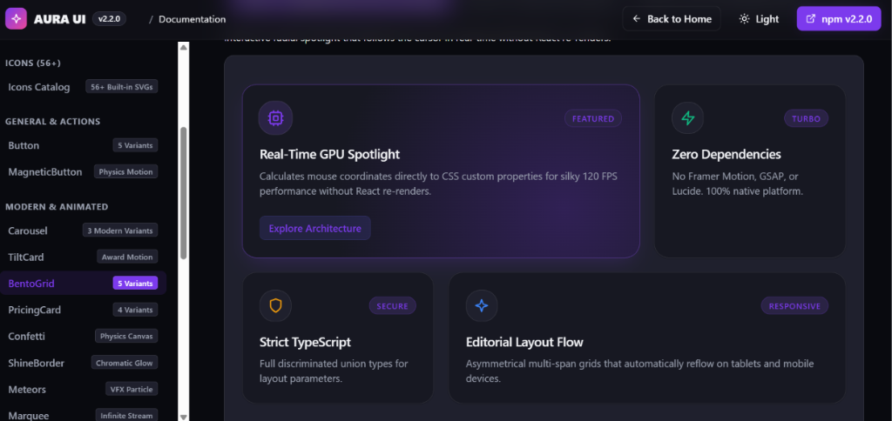

<div align="center">

# Aura UI Library 2.3

<p align="center">
  <strong>The zero-runtime dependency React UI system for cinematic digital experiences.</strong>
</p>

[](https://www.npmjs.com/package/aura-ui-library)
[](https://www.npmjs.com/package/aura-ui-library)
[](https://www.typescriptlang.org/)
[](https://developer.mozilla.org/en-US/docs/Web/API/Web_Animations_API)
[](LICENSE)
[](https://aura-ui-lib.vercel.app/)

<br />

<!-- Showcase Demo Preview -->
<p align="center">
  <a href="https://aura-ui-lib.vercel.app/" target="_blank" rel="noopener noreferrer">
    
  </a>
</p>

<br />

</div>

---

## ✦ Why Aura UI 2.3?

Building modern web apps usually means installing **GSAP, Framer Motion, Lucide, Tailwind, Radix, Classnames, and Lodash** — easily adding over **350 kB** of JavaScript before you write a single line of application code.

**Aura UI breaks that cycle.** Every animation, spotlight, 3D perspective card, dropdown, and carousel is engineered with **pure CSS custom properties, Web APIs, and React primitives**.

| Metric | Aura UI 2.3 | Standard Stack (Framer + Radix + Lucide) |
| :--- | :--- | :--- |
| **Runtime Dependencies** | **`0`** (`dependencies: {}`) | 12+ packages |
| **Animation Engine** | **Native CSS & WAAPI (120 FPS)** | JavaScript RAF loops (~40kB JS) |
| **Icons Included** | **56+ Zero-Dep Inline SVGs** | Lucide / React Icons (~80kB JS) |
| **Next.js & SSR Safety** | **100% Hydration Safe** | Requires `"use client"` wrappers everywhere |
| **Dark / Light Modes** | **Instant via CSS Tokens** | Complex runtime context re-renders |

---

## ✦ Quick Installation

```bash
npm install aura-ui-library
```

Or using **pnpm**, **yarn**, or **bun**:

```bash
pnpm add aura-ui-library
# or
yarn add aura-ui-library
# or
bun add aura-ui-library
```

---

## ✦ Getting Started

### 1. Import Global Styles

Import the tokenized stylesheet once in your application entry file (`main.tsx`, `index.tsx`, or `app/layout.tsx`):

```tsx
import "aura-ui-library/styles.css";
```

### 2. Wrap with `AuraProvider`

```tsx
import React from "react";
import { AuraProvider, Button, Card, Stack, Text } from "aura-ui-library";

export default function App() {
  return (
    <AuraProvider defaultTheme="dark" accentColor="#7c3aed">
      <Card variant="glass" style={{ maxWidth: 460, margin: "3rem auto" }}>
        <Card.Header>
          <Card.Title>Aura UI 2.3</Card.Title>
          <Card.Description>Quiet luxury design system</Card.Description>
        </Card.Header>
        <Card.Body>
          <Stack gap={4}>
            <Text variant="muted">
              Zero dependencies, tree-shakable, with native 3D coverflow and cursor spotlight cards.
            </Text>
            <Button variant="solid" size="md">
              Explore Primitives →
            </Button>
          </Stack>
        </Card.Body>
      </Card>
    </AuraProvider>
  );
}
```

---

## ✦ Flagship Components & Features

### 🍱 BentoGrid & BentoCard (5 Modern Variants)
Apple & Linear style asymmetrical bento grids with real-time GPU cursor spotlight tracking.

```tsx
import { BentoGrid, BentoCard, Button, CpuIcon, ZapIcon, ShieldIcon } from "aura-ui-library";

<BentoGrid columns={3} gap="md">
  {/* Variant: Spotlight Glow */}
  <BentoCard
    colSpan={2}
    variant="glow"
    glowColor="rgba(124, 58, 237, 0.25)"
    badge="FEATURED"
    icon={<CpuIcon size={22} />}
    title="Real-Time GPU Cursor Spotlight"
    description="Updates mouse coordinates directly to CSS custom properties for silky 120 FPS performance."
    cta={<Button size="sm" variant="soft">Explore Core</Button>}
  />

  {/* Variant: Frosted Glass */}
  <BentoCard
    colSpan={1}
    variant="glass"
    badge="TURBO"
    icon={<ZapIcon size={22} color="#10b981" />}
    title="Zero Dependencies"
    description="No Framer Motion or GSAP. 100% native browser platform."
  />

  {/* Variant: Interactive Micro-Lift */}
  <BentoCard
    colSpan={3}
    variant="interactive"
    badge="TACTILE"
    icon={<ShieldIcon size={22} color="#f59e0b" />}
    title="Tactile Spring Press State"
    description="Click to feel physical damping response."
  />
</BentoGrid>
```

**Supported Variants:**
- `variant="default"`: Clean minimalist surface with crisp borders.
- `variant="glow"`: Specular radial spotlight that tracks cursor movement in real time.
- `variant="glass"`: Frosted glassmorphism with backdrop blur and specular highlights.
- `variant="gradient"`: Ambient sheen mesh that adapts seamlessly across dark and light modes.
- `variant="interactive"`: Tactile hover lift and physical spring click feedback.

---

### 🎠 3D Coverflow Deck & Card Carousel
True 3D perspective depth with card peeking, cyclic rotation, keyboard navigation, touch swipes, and autoplay.

```tsx
import { Carousel, Button } from "aura-ui-library";

<Carousel
  variant="card"
  perspective={1000}
  autoplay={true}
  autoplayInterval={4500}
  pauseOnHover={true}
  showDots={true}
  showArrows={true}
  showCounter={true}
>
  <Carousel.Slide>
    <div className="slide-content">
      <h3>Next-Gen Cloud Engine</h3>
      <p>Sub-millisecond edge routing across 320 global datacenters.</p>
      <Button variant="solid" size="sm">Deploy Cluster</Button>
    </div>
  </Carousel.Slide>

  <Carousel.Slide>
    <div className="slide-content">
      <h3>Autonomous Security</h3>
      <p>Continuous AI vulnerability assessment and instant mitigation.</p>
    </div>
  </Carousel.Slide>

  <Carousel.Slide>
    <div className="slide-content">
      <h3>Zero-Config Observability</h3>
      <p>Real-time distributed telemetry with zero sampling overhead.</p>
    </div>
  </Carousel.Slide>
</Carousel>
```

---

### 🧭 Interactive Navbars & Mobile Drawer
Floating glassmorphism navigation with nested interactive dropdowns, mobile hamburger drawer, and actions.

```tsx
import { Navbar, Button } from "aura-ui-library";

<Navbar
  variant="floating"
  brand={<span style={{ fontWeight: 700, fontSize: "1.1rem" }}>Aura UI</span>}
  items={[
    {
      label: "Products",
      children: [
        { label: "Cloud Engine", description: "Edge routing across 300+ PoPs", href: "#cloud" },
        { label: "Autonomous Security", description: "Zero-trust network defense", href: "#security" },
      ],
    },
    { label: "Docs", href: "#docs" },
    { label: "Changelog", href: "#changelog" },
  ]}
  actions={
    <Button variant="solid" size="sm">
      Get Started
    </Button>
  }
/>
```

---

### 🌌 Cinematic Background Primitives
Zero-dependency hardware-accelerated background stages:

```tsx
import { AuroraBackground, DotBackground, GridPattern } from "aura-ui-library";

// 1. Fluid Aurora Light Wave
<AuroraBackground>
  <HeroContent />
</AuroraBackground>

// 2. High-Tech Matrix Dots
<DotBackground color="rgba(124, 58, 237, 0.25)" spacing={24}>
  <HeroContent />
</DotBackground>

// 3. Crisp Vector Grid
<GridPattern width={40} height={40}>
  <HeroContent />
</GridPattern>
```

---

### ⚡ Interactive Motion & Micro-interactions
Physics and tactile delight without any animation runtime:

```tsx
import { 
  MagneticButton, 
  TiltCard, 
  Confetti, 
  TextReveal, 
  Meteors, 
  Marquee, 
  ShineBorder 
} from "aura-ui-library";

// Physics-attracted cursor button (3 variants: magnetic, ripple, spring-border)
<MagneticButton variant="magnetic" strength={0.4}>
  Attract Cursor ⚡
</MagneticButton>

// 3D Apple-style gyro perspective tilt card with specular glare
<TiltCard maxTilt={15} glare={true}>
  <CardContent />
</TiltCard>

// Falling celestial meteors shower
<Meteors count={25} />

// Infinite smooth scrolling ticker with pause-on-hover
<Marquee pauseOnHover speed={40}>
  <LogoStrip />
</Marquee>

// HTML5 Canvas celebratory confetti explosion
const confettiRef = useRef<ConfettiHandle>(null);
confettiRef.current?.fire({ particleCount: 100 });
```

---

### 🎨 56+ Zero-Dependency Inline SVG Icons
Never install `react-icons` or `lucide-react` again. Accessible, customizable inline SVGs:

```tsx
import { 
  CheckIcon, 
  SparklesIcon, 
  ZapIcon, 
  ShieldIcon, 
  TerminalIcon, 
  GlobeIcon, 
  CpuIcon, 
  CloudIcon, 
  LayersIcon, 
  SlidersIcon, 
  SunIcon, 
  MoonIcon 
} from "aura-ui-library";

<SparklesIcon size={24} color="#7c3aed" />
<CpuIcon size={20} color="var(--aura-accent)" />
```

---

## ✦ Design Tokens & Customization

All components consume semantic CSS variables prefixed with `--aura-*`. Switch themes dynamically or customize any token:

```css
:root {
  /* Surfaces */
  --aura-bg: #07080d;
  --aura-surface: #12141e;
  --aura-surface-raised: #1a1e2d;

  /* Typography */
  --aura-fg: #f4f5f9;
  --aura-fg-muted: #9499ab;

  /* Accent & Borders */
  --aura-accent: #7c3aed;
  --aura-border: rgba(255, 255, 255, 0.08);
  --aura-border-strong: rgba(255, 255, 255, 0.18);

  /* Radii & Shadows */
  --aura-radius-md: 12px;
  --aura-radius-lg: 18px;
  --aura-radius-xl: 24px;
}
```

```tsx
<AuraProvider
  defaultTheme="dark"
  tokens={{
    colors: {
      accent: "#06b6d4",
      background: "#030712",
    },
  }}
>
  <App />
</AuraProvider>
```

---

## ✦ Complete Component Catalog

| Category | Primitives |
| :--- | :--- |
| **Foundations** | `AuraProvider`, `useAuraTheme`, `Container`, `Stack`, `Inline`, `Grid`, `Separator`, `Portal`, `Slot`, `FocusRing` |
| **Typography** | `Heading`, `Text`, `Label`, `Code`, `Kbd`, `Link` |
| **Basic UI** | `Button`, `IconButton`, `Badge`, `Avatar`, `Card`, `Surface`, `Skeleton`, `Spinner`, `Progress`, `Tooltip` |
| **Forms** | `Input`, `Textarea`, `Checkbox`, `Switch`, `Select`, `Slider`, `FormField` |
| **Overlays** | `Dialog`, `Alert`, `Toast` |
| **Navigation** | `Navbar`, `Sidebar`, `Tabs`, `Breadcrumb` |
| **Modern & Animated**| `BentoGrid`, `BentoCard`, `Carousel`, `TiltCard`, `PricingCard`, `MagneticButton`, `TextReveal`, `ShineBorder`, `Meteors`, `Marquee`, `Confetti` |
| **Backgrounds** | `AuroraBackground`, `DotBackground`, `GridPattern` |
| **Icons** | 56+ Zero-Dependency Inline SVG Icons |

---

## ✦ Development & Scripts

```bash
# Start local interactive showcase playground
npm run dev

# Run strict TypeScript validation
npm run typecheck

# Build ESM & CJS distribution bundles with declaration types
npm run build
```

---

## ✦ License

MIT © [Aura UI Team](https://github.com/RitikWeb22)
